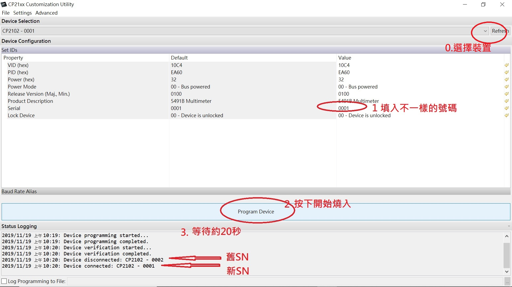

## CP21xx Silicon labs. USB2UART adapter used in multi-port USB and fixed COM port number on PC
### CP21xx 在同一台PC下使用多個COM port 但共用windows driver 不同的COM port各自有固定號碼(fixed COM port number)

插上想變更設備到PC USB port (只要是使用CP21xx IC 都可以), 目的就是要變更裝置的SN號碼使driver 可以分辨在同一個VID/PID下的USB IC.

按原廠指示的確可以完成這樣的訴求:

!(https://www.cubeatsystems.com/ifx-49/resources/datasheets/AN721.pdf)

下載地址:

https://www.silabs.com/support/resources.ct-application-notes.ct-example-code.p-interface

AN721: CP210x/CP211x Device Customization Guide	        6.7.5	    Example Code

一張圖解決了你的疑問:
